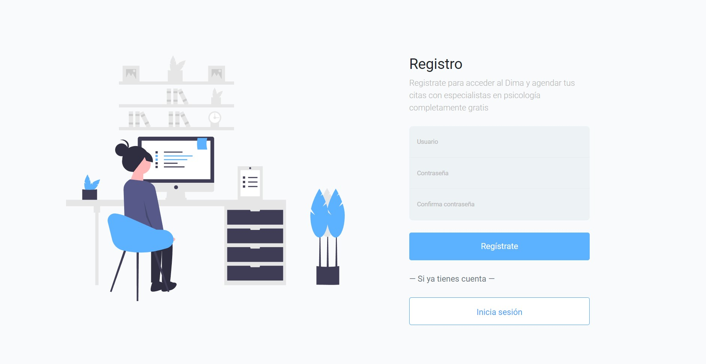
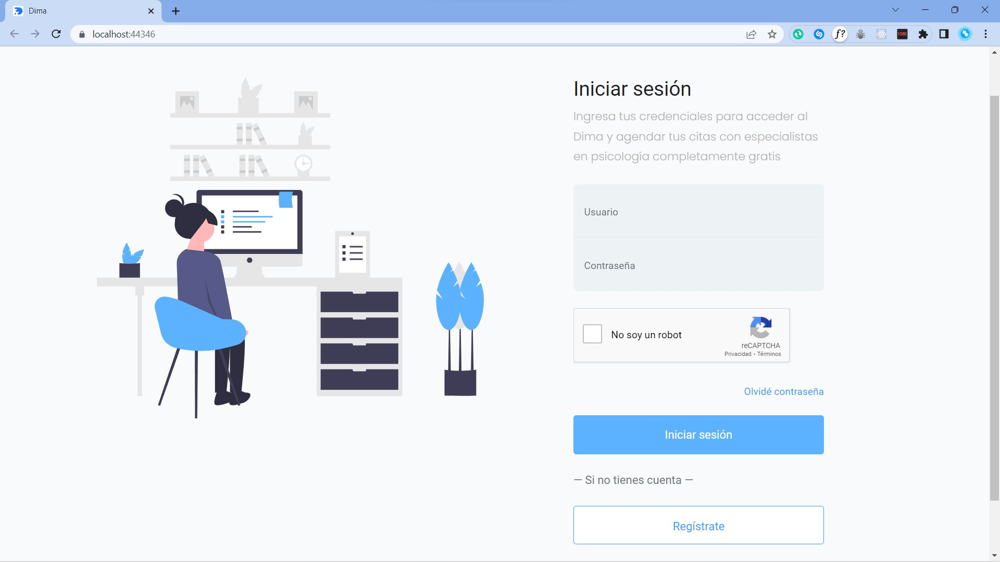
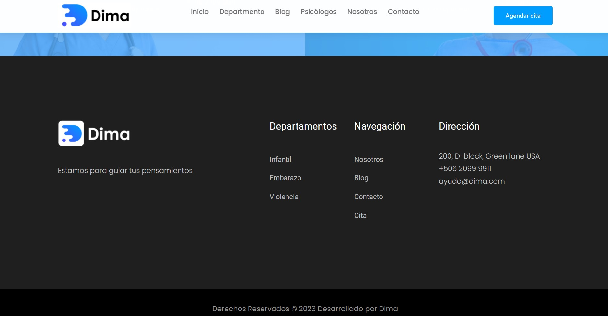
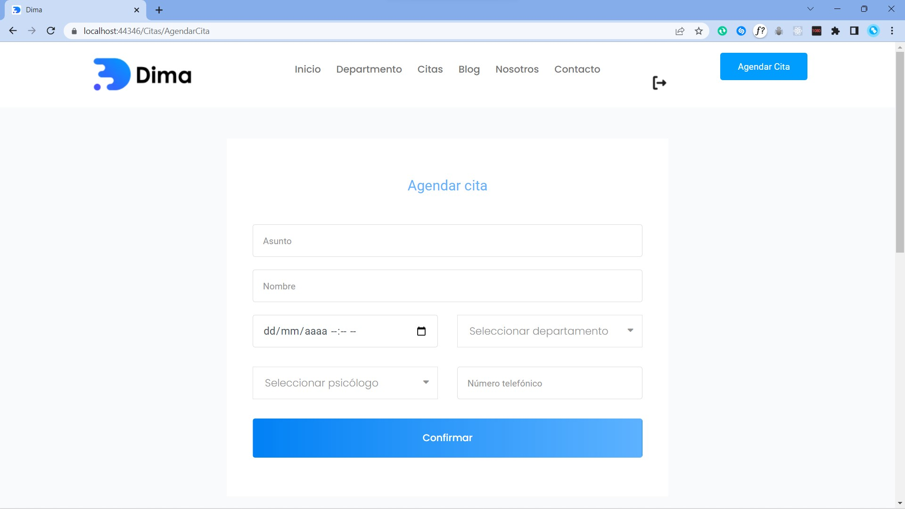
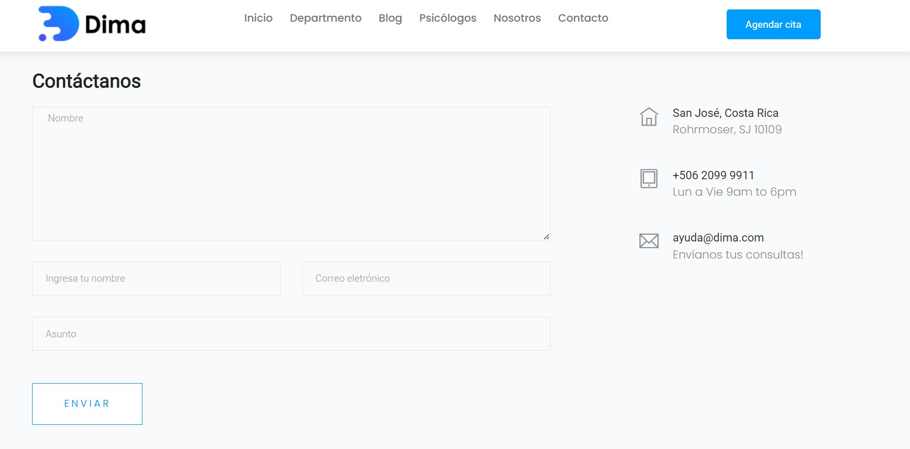
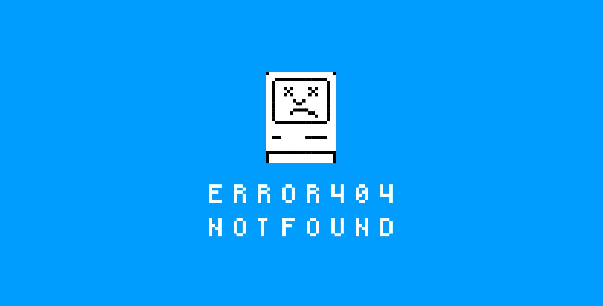

# Dima - Ayuda psicológica 🧠✨

`Dima` es una aplicación que nace con la prioridad de brindar sesiones con profesionales de la salud mental completamente gratis  a los usuarios que no cuenten con el presupuesto.

Desde `Dima` los usuarios pueden agendar citas en línea.

> No hay salud sin salud mental

---

**Tecnologías utilizadas:**

## Secciones

- [Configura Dima localmente](#configura-dima-localmente)
- [Usuarios](#usuarios)
- [Dima](#dima)

## Configura Dima localmente

**Script**

Copiar el contenido del archivo llamado `script.sql` ubicado en la carpeta `ProyectoDimaWeb/SQL`

**SQL Server Management Studio SSMS**

Pegar y ejecutar el script en [SQL Server Management Studio](https://learn.microsoft.com/en-us/sql/ssms/download-sql-server-management-studio-ssms?view=sql-server-ver16)

**Dima API**

Se debe agregar el modelo de la base de datos al proyecto API siguiendo los siguientes pasos:

* Primero debe ir al archivo llamado `Web.config` ubicado en la raíz de la carpeta llamada `Dima_Api` ubicada en `ProyectoDimaWeb/`
    * Una vez esté en el archivo llamado `Web.config` busque la etiqueta `<connectionStrings> </connectionStrings>` y **asegurese** que la etiqueta esté **vacía**. **NO** eliminar las etiquetas
* Una vez se **aseguró** las etiquetas **sí** existen, pero están **vacías**, dar clic derecho sobre la carpeta llamada `ModeloBD`
* Clic  en `Aregar` y en `Nuevo elemento`
* Seleccionar `Datos` de las opciones de la izquierda
* Seleccionar la opción `ADO.NET Entity Data Model` y `Seleccionar`
* Clic en `EF Designer desde base de datos` y `Siguiente`
* `Nueva conexión...`
* En nombre del servido colocar el exactamente el mismo que muestra SQL Server Management Studio para crear una conexión
* Dar clic en el dropdown `Seleccionar o escribir el nombre de la base de datos:` y seleccionar la base de datos llamada `docmed` y `Aceptar`
* La ventana se cerrará, dar clic en `Siguiente`
* Desplegar la primera opción llamada `Tablas` y marcar la opción `dbo` y la última llamada `Funciones y procedimientos alamacenados` y marcar la opción `dbo`
* Por último dar clic en `Finalizar` y esperar al rededor de 35 segundos
* Una vez se haya generado el model saldrá una advertencia, dar clic en `Sí a todo`

## Usuarios

**Registro**

Los usuarios pueden registrarse en el sistema con tan solo un correo electrónico y contraseña.

**Iniciar sesión**

Cada usuario puede ingresar al sistema con las credenciales registradas.

**Recuperar contraseña**

En caso de olvidar la contraseña, prodrá recuperarla ingresando el correo electrónico registrado en el sistema al que se le enviará la respectiva contraseña

## Dima

**Barra de navegación**

**Pie de página**

**Agendar cita**

**Contacto**

**Error 404**

